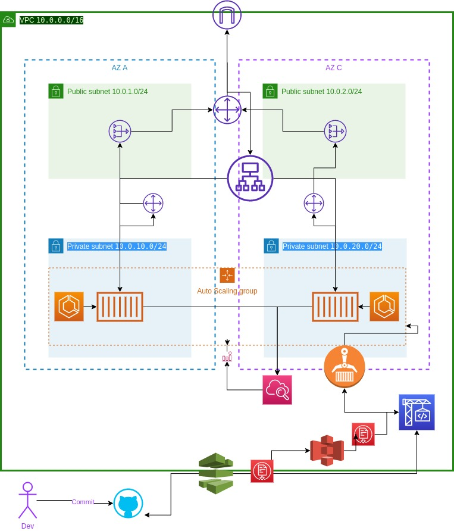

## Considerações Api Comments
- Primeiros testes foram locais, criei o Dockerfile e o docker-compose para certificar que a api conseguiria rodar em um container. Após isso, comecei a criar os arquivos terraform para a implantação de infraestrura, não os testei pois ja havia usado um código próprio no qual ja havia aplicado. O que fui testando foi a aplicação rodando em fargate já que nunca havia usado, somente instancias ec2.

- Gostaria de melhorar a coleta de logs talvez usando o elk, aplicando primeiro um filebeat no cluster ecs e subindo um logstash centralizado em outra instancia e um cluster de Elastic Search.
- Aplicar stages de teste no codepipeline para certificar que o codigo esteja funcional.

- Decidi usar o fargate pela sua facilidade e rapidez de criação, sem precisar criar uma instancia ec2 para rodar os serviços do cluster ECS, talvez não seja a melhor escolha de custo, dependendo das configurações, mas pela rapidez é uma boa escolha.
- Somente usei a arquitetura padrão de qualquer documentação AWS. (VPC, Subnets privadas e publicas, NAT Gateway e também pela facilidade o CodeBuild e CodePipeline integrado ao repositorio ja criado no github)

